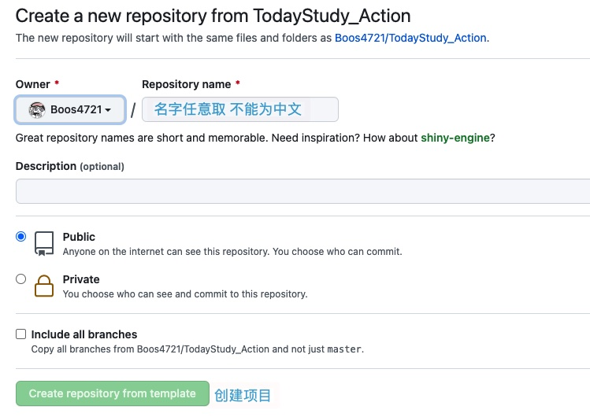

# 今日校园自动化签到/查寝/信息收集

## 如何使用

1. 点击右上绿色的**Use this template**
2. 如图部署到你的仓库后开始第二步

## 配置&部署

1. 编辑里面的 **[config.yml](https://github.com/Boos4721/TodayStudy_Action/blob/master/config.yml)** 为你自己的配置
2. 替换`sign.jpg`为你的图片(**如果你不需要**)
3. 若你登录需要验证码登录修改 **[system.yml](https://github.com/Boos4721/TodayStudy_Action/blob/master/system.yml)**
4. 修改`.github/workflows/auto_attendance.yml`里的 **[第七行](https://github.com/Boos4721/TodayStudy_Action/blob/fb628fab34357fc904f73232ec227744e4035d7c/.github/workflows/auto_attendance.yml#L7)** 划重点这里是使用的是**UTC**时间 
**[在线转换UTC时间](http://www.timebie.com/cn/universalbeijing.php)**
5. 到了你设置的时间就可以自动进行**签到/查寝/信息收集**了
6. `Github`使用的是**POSIX cron 语法**不支持秒 **设置的时间可以提前10-15分钟，因为`Action`有一点延迟** 
[点我查看Github说明](https://docs.github.com/cn/actions/learn-github-actions/workflow-syntax-for-github-actions#example)

## 测试

1. 点击右上的**Star**
2. 进入**Actions**查看运行状态

## 个人建议

- 测试完成后改成私人项目最佳
- [如何转成私人](https://blog.csdn.net/cnds123321/article/details/86763411)

## 引用说明

- [若离的今日校园脚本](https://github.com/thriving123/fuckTodayStudy.git)
- [Microsoft Azure](https://azure.microsoft.com)
- [GitHub Actions](https://github.com/features/actions)

## License

[MIT](https://github.com/Boos4721/TodayStudy_Action/blob/master/LICENSE) © [**Boos4721**](https://boos4721.github.io/TodayStudy_Action/)
